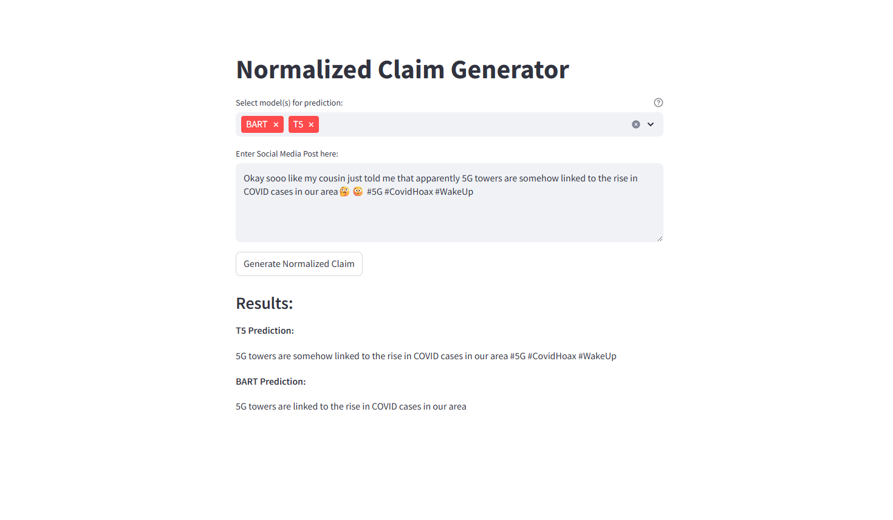

# Claim Normalization Streamlit App

This project provides an interactive Streamlit interface for normalizing messy social media claims using transformer-based models. Users can select between **T5-small** and **BART-base** models or use both simultaneously to view the normalized outputs.

---

## 📁 Project Setup

### 🔹 Step 1: Navigate to Project Directory

Move to the main project folder:

```bash
cd Final
```

---

### 🔹 Step 2: Activate Virtual Environment

Activate the provided virtual environment (or use your own):

```bash
venvClaimNormalization\Scripts\activate
```

---

### 🔹 Step 3: Install Required Dependencies

Install all required Python packages:

```bash
pip install -r requirements.txt
```

---

### 🔹 Step 4: Launch Streamlit App

Navigate to the `Src` directory where the main app is located and run it:

```bash
cd Src
streamlit run app.py
```

---

## ⚙️ Features

* **Model Selection:** Choose between `T5-small`, `BART-base`, or both.
* **Real-time Inference:** Enter any noisy/messy claim text and get cleaned, normalized versions.
* **Comparison:** When both models are selected, their outputs are shown side-by-side.

---

## 🤖 Models Used

* **T5-small:** Fine-tuned for text normalization.
* **BART-base:** Another powerful model fine-tuned for similar tasks.

Models are locally stored and loaded efficiently during runtime.

---

## 🖼️ Streamlit UI Preview


